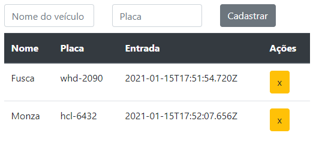

# Estacionamento

This project is part from the course from [Digital Innovation One](https://web.digitalinnovation.one/) to study [Typescript](https://www.typescriptlang.org/).

    

---

# Guide

- [Features](#features)
- [Installation](#installation)
- [Using](#using)
- [Technologies](#technologies)
- [Future Implementations](#future-implementations)

# Features

- We can add and remove vehicles from a parking.
- Uses HTML Javascript

# Installation

`git clone https://github.com/cledman/typescript-estacionamento`

# Using

***before using***, type on terminal from your folder: `npx -p typescript tsc`

`Run the index.html file`

# Technologies

- [HTML](https://www.w3schools.com/html/) to write the page,
- [Bootstrap](https://getbootstrap.com/) to handle styles too.

# Future Implementations

- We could have more elements.
- Add [CSS](https://www.w3schools.com/css/) to handle the styles, layout and rendering,
- Better work on UX.

Thanks to:

- [Andre Soares](https://github.com/soaresderik)

##